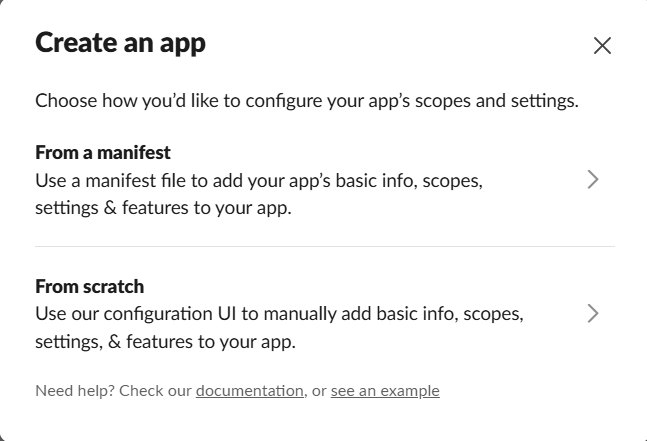
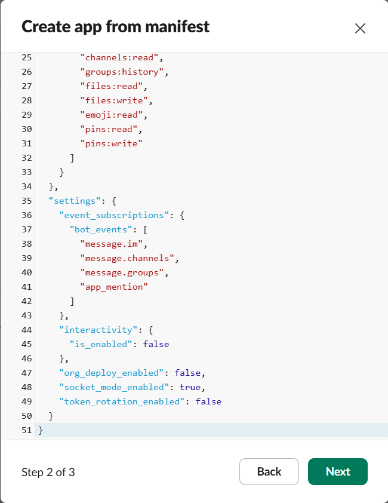
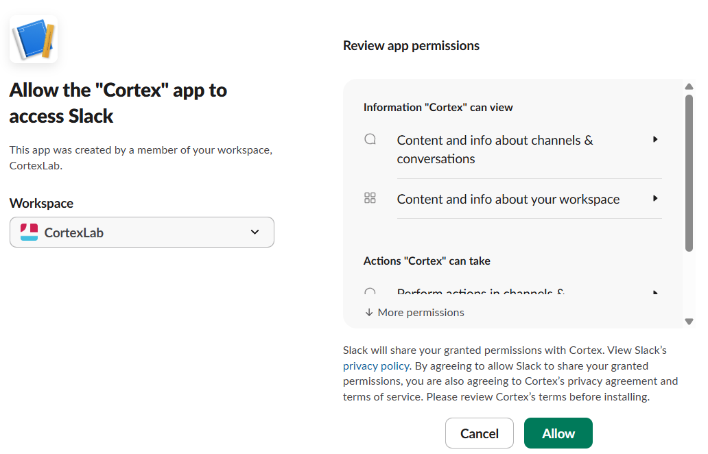
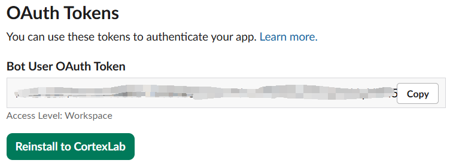

# Quickstart

From zero to a Cortex agent answering you in Slack in about 15 minutes,
most of which is waiting for `npm` and clicking through Slack's app
creation page.

`cortex init` does almost everything. You will not edit a single config
file by hand. This guide tells you what to expect at each prompt — and
shows you exactly where to click in Slack.

## Prerequisites

- **Node.js ≥ 20** (Cortex itself targets 20+; the bundled coding-agent
  backends prefer 22).
- **A Slack workspace** where you can create an app. (Feishu / Lark is
  also supported — see [slack-setup.md](./slack-setup.md) for the
  equivalent flow.)
- **About 2 GB of free disk** for backends, plugins, and logs.

You do **not** need to install `claude` (Claude Code) or `pi`
(pi-coding-agent) beforehand. You do not need to install `git`
beforehand. You do not need to pre-create any directories or env files.
`cortex init` installs all of these for you.

### Checking your Node.js version

Open a terminal and run:

```bash
node --version
```

You should see something like `v22.14.0`. If the version is below 20,
or if you see `command not found: node`, install or upgrade Node.js
using one of the methods below.


### Installing Node.js

**macOS (Homebrew):**

```bash
brew install node@22
```

**Linux (nvm, recommended):**

```bash
curl -o- https://raw.githubusercontent.com/nvm-sh/nvm/v0.40.3/install.sh | bash
# Restart your shell, then:
nvm install 22
nvm use 22
```

**Linux (apt, Ubuntu/Debian 24.04+):**

```bash
sudo apt update && sudo apt install nodejs npm
```

**Windows:**

Download the LTS installer from [nodejs.org](https://nodejs.org/)
(choose the "LTS" version, 22.x or later). Run the `.msi` installer
and follow the prompts. After installation, restart your terminal.

Verify the installation:

```bash
node --version   # should print v22.x.y or v20.x.y
npm --version    # should print 10.x.y or later
```

## Step 1 — Install Cortex

```bash
npm install -g @cortex-agent/server
```

This puts three commands on your PATH: `cortex`, `cortex-task`, and
`cortex-run`.

If `npm install -g` fails with a permission error (common on Linux),
prefix with `sudo`, or better, configure npm to use a user-local
prefix:

```bash
mkdir -p ~/.npm-global
npm config set prefix ~/.npm-global
echo 'export PATH=~/.npm-global/bin:$PATH' >> ~/.bashrc
source ~/.bashrc
npm install -g @cortex-agent/server
```

## Step 2 — Run the setup wizard

```bash
cortex init
```

The wizard walks through the following prompts. Defaults are sensible;
hit Enter to accept. Here is what each prompt does and how to answer.

### 2.1 Which backends?

```
? Which coding-agent backends would you like to use?
❯ ◯ Claude Code (recommended for Anthropic subscriptions)
  ◯ PI (for other subscriptions)
```

- **Claude Code** — recommended if you have an Anthropic subscription
  (Claude Pro, Max, or API). Cortex will install it automatically.
- **PI** — use if you subscribe to other LLM providers through PI.

You can pick both. Cortex runs `npm install -g` for whichever you
select on the next step.

### 2.2 Which interaction platform?

```
? Which interaction platform?
❯ ● Slack (recommended)
  ○ Skip (configure later)
```

Pick **Slack**. This triggers the token-collection steps below. If you
pick Skip, you can set up the platform later with `cortex init --force`
or by editing `$CORTEX_HOME/config/.env`.

### 2.3 Slack app setup (step by step in the browser)

Cortex first prints a complete **Slack App Manifest** and asks if you
want it copied to your clipboard. Answer **Yes** — the manifest JSON
is now in your clipboard.

Now switch to your browser. Here is exactly where to go and what to
click.

#### a) Open the Slack API apps page

Go to **[https://api.slack.com/apps](https://api.slack.com/apps)**.


#### b) Create a new app from manifest

Click the green **Create New App** button, then click **From a
manifest**.



#### c) Pick your workspace and paste the manifest

1. Select your Slack workspace from the dropdown (top-right corner).
2. Paste the manifest JSON into the text area (Ctrl+V / Cmd+V). The
   manifest was copied to your clipboard by `cortex init`, so just paste.
3. Click **Next**.
4. Review the summary and click **Create**.



#### d) Copy the Signing Secret

After creation, Slack drops you on the app's **Basic Information**
page. Under **App Credentials**, find the **Signing Secret**. Click
**Show** and copy it.

Back in your terminal, paste this as `SLACK_SIGNING_SECRET`.


#### e) Generate the App-Level Token (xapp-…)

Scroll down on the same **Basic Information** page to the
**App-Level Tokens** section. Click **Generate Token and Scopes**.

- Token Name: `cortex-socket`
- Add Scope: `connections:write`
- Click **Generate**

Copy the token that appears (starts with `xapp-`). It only shows once
— copy it now.

Back in your terminal, paste this as `SLACK_APP_TOKEN`.


#### f) Install to Workspace and copy the Bot Token (xoxb-…)

In the left sidebar, click **OAuth & Permissions**. Scroll up to the
**OAuth Tokens** section and click **Install to Workspace**. On the
authorization screen, click **Allow**.

After installation, the page shows a **Bot User OAuth Token** at the
top (starts with `xoxb-`). Copy it.

Back in your terminal, paste this as `SLACK_BOT_TOKEN`.





#### g) Enable the Messages Tab

In the left sidebar, click **App Home**. Scroll down to the **Show
Tabs** section:

- Check **Messages Tab** (so it appears in the bot's App Home).
- Check **Allow users to send Slash commands and messages from the
  messages tab** (so you can DM the bot).

Without this checkbox, you can `@cortex` the bot in channels but you
cannot send it DMs.


#### h) Admin channel (optional)

Cortex asks for `CORTEX_ADMIN_CHANNEL`. You can leave it **blank** —
Cortex auto-detects your admin channel the first time you DM it.

If you want to set it explicitly (e.g., admin notifications should go
to a shared channel), grab the channel ID from Slack: right-click the
channel name → View channel details → copy the Channel ID from the
bottom of the dialog.

### 2.4 Machine name

Defaults to your hostname. Hit Enter unless you want a custom label.

### 2.5 GPU detection

Cortex runs `nvidia-smi` and prints the count. Nothing to type. If you
don't have an NVIDIA GPU, it prints 0 — perfectly fine for most usage.

### 2.6 aistatus token-usage reporting?

Optional opt-in to share anonymous token counts on the public
leaderboard at [aistatus.cc](https://aistatus.cc). If you answer yes,
provide a name, org, and email (email is identity only, never
displayed).

### 2.7 Register as a system service?

- **macOS** — creates a `launchd` plist at
  `~/Library/LaunchAgents/com.cortex.daemon.plist`. The daemon starts
  automatically on login.
- **Linux** — creates a `systemd --user` unit (no `sudo` needed). The
  daemon starts automatically on login.
- **Windows** — not supported. Start manually with `cortex start`.

### 2.8 Auto-detect backends for gateway/profiles?

Answer **Yes** if you already ran `claude login` and/or `pi login` in
another shell. Cortex scans your `~/.claude/.credentials.json` and
`~/.pi/agent/` to discover endpoints and asks you to pick which
discovered (mode, model) pair becomes the `plan` profile (used by
executor agents — planner, doc-writer, coder, etc.) and which becomes
the `execute` profile (used by reviewer agents).

You can also run this later with `cortex setup-gateway`.

---

When the wizard finishes you will see:

```
Cortex initialized at /home/you/.cortex. Run `cortex start` to launch.
```

## What `cortex init` created

Everything lives under `CORTEX_HOME` (default `~/.cortex/`):

```
~/.cortex/
├── .git/                       # auto git-init'd, all state is committed
├── CORTEX.md                   # root agent context (seeded from defaults)
├── config/
│   ├── .env                    # platform tokens + CORTEX_MACHINE
│   ├── budget.json             # daily/monthly budget limits
│   ├── machines.json           # this machine's capabilities (gpuCount, path)
│   ├── mcp-config.json         # main MCP server entry
│   ├── mcp-config-core.json    # subset for restricted contexts
│   ├── mcp-config-tui.json     # subset for TUI mode
│   ├── profiles.json           # named (backend, model) profiles
│   ├── session-hooks.json      # session-level hook pipeline
│   └── thread-templates.json   # multi-agent thread definitions
├── data/
│   ├── mode.json               # current mode + active profile
│   └── schedules.json          # seeded recurring tasks
├── context/                    # the project log lives here
│   ├── CORTEX.md, projects/, decisions/, scans/, ideas/, retrospectives/, user/
├── plugins/                    # 8 role-scoped skill plugins (full copy of defaults)
├── prompts/                    # directives, system prompts, templates
├── rules/                      # rule files auto-loaded by agents
├── hooks/                      # hook scripts (.mjs)
├── .claude/                    # Claude Code hooks + settings
└── logs/                       # daemon + LLM logs
```

You should **not** need to edit any of these by hand for normal use.
`cortex init --force` regenerates the auto-generated ones
(`mcp-config*.json`, `machines.json`, `mode.json`) while preserving
your `.env`, profiles, and content files.

`~/.aistatus/` separately holds:

```
~/.aistatus/
├── gateway.yaml                # gateway routing config (auto-generated)
└── config.yaml                 # aistatus uploader settings (your name/org/email)
```

## Step 3 — Start the server

```bash
cortex start          # foreground, Ctrl-C to stop
# or
cortex daemon         # supervised, restarts on crash + hot-reload
```

If you chose to register a system service in Step 2.7, the daemon is
already running and you can skip this. Check with:

```bash
cortex config         # prints resolved paths + init status
```

You should see output confirming the daemon is running, including the
Slack connection status and active profiles.


## Step 4 — Send your first messages

Now the fun part. Open Slack, find the Cortex bot you just installed,
and start a DM.

### 4.1 Say hello

Send a DM to the bot:

```
hello
```

The first DM is what Cortex uses to auto-detect your admin channel if
you left `CORTEX_ADMIN_CHANNEL` blank. You should get a reply within a
few seconds.


### 4.2 Create your first project

Give Cortex a mission. Cortex will create the project, set up the
directory structure, and confirm back to you:

```
create a project called "hello-world" — I want to build a
simple web dashboard that shows the weather in my city
```

Cortex replies with the project structure it created, the initial
tasks it decomposed, and asks if you want it to start working on them.


### 4.3 Create a task in an existing project

Once you have a project, you can add tasks to it directly from Slack:

```
in project hello-world, add a task: add a 5-day forecast
chart using Chart.js
```

Cortex adds the task to the project's `TASKS.yaml`, assigns it a hex
ID, sets priority and dependencies, and confirms back.


### 4.4 Check project status

```
status of hello-world
```

Cortex reads the project's `STATUS.md`, `TASKS.yaml`, and recent
experiment records, then gives you a summary of where things stand.

Once a project has tasks in its queue, Cortex automatically picks up
and dispatches the highest-priority ready task — you don't need to
tell it to "start working." Just keep adding tasks and Cortex will work
through them autonomously.

## What to read next

- The Slack app setup failed, or you want to do it before running
  `cortex init` — read [slack-setup.md](./slack-setup.md).
- You want to know every config file and env var Cortex understands,
  or override one of the auto-generated paths — read
  [configuration.md](./configuration.md).
- You want to know every CLI subcommand and flag — read
  [cli-reference.md](./cli-reference.md).
- You want to switch backends or add another provider — read
  [backends.md](./backends.md).
- You want to understand how the multi-agent thread pipelines work —
  read [threads.md](./threads.md).
- You want to connect remote machines to Cortex — read
  [cross-machine.md](./cross-machine.md).
- You want to understand the project log structure (experiments,
  knowledge, patterns) — read [memory.md](./memory.md).
