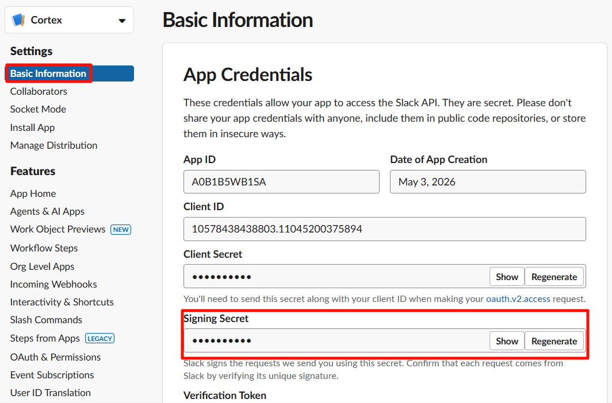
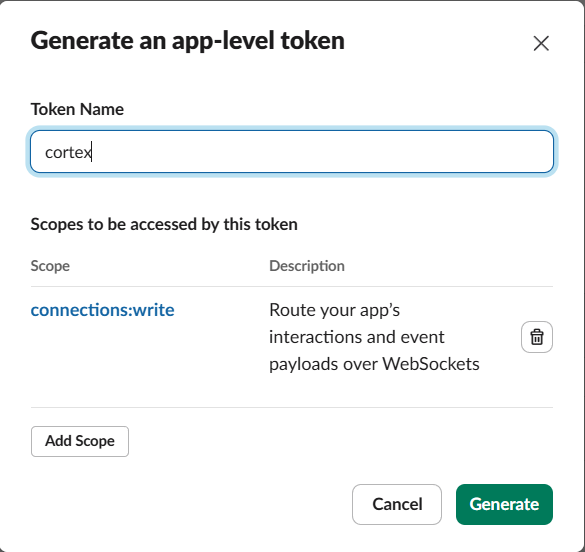
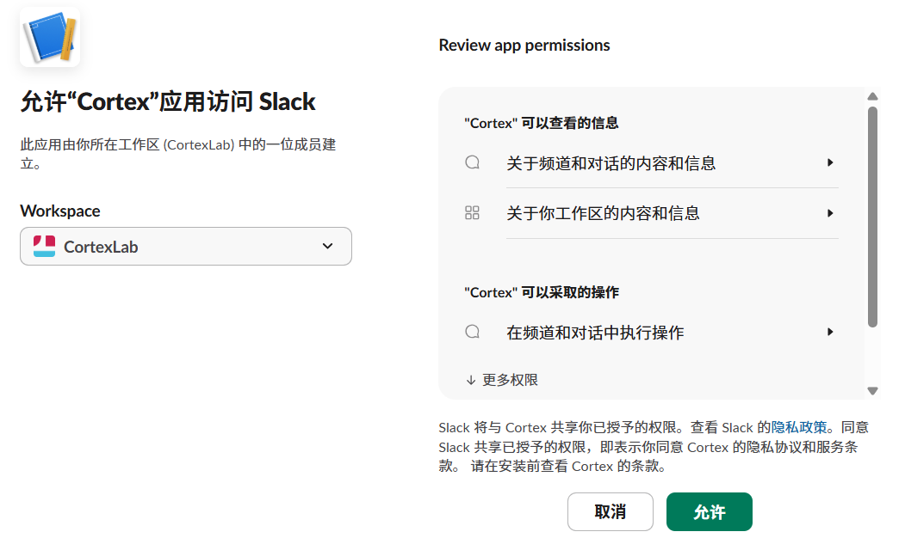
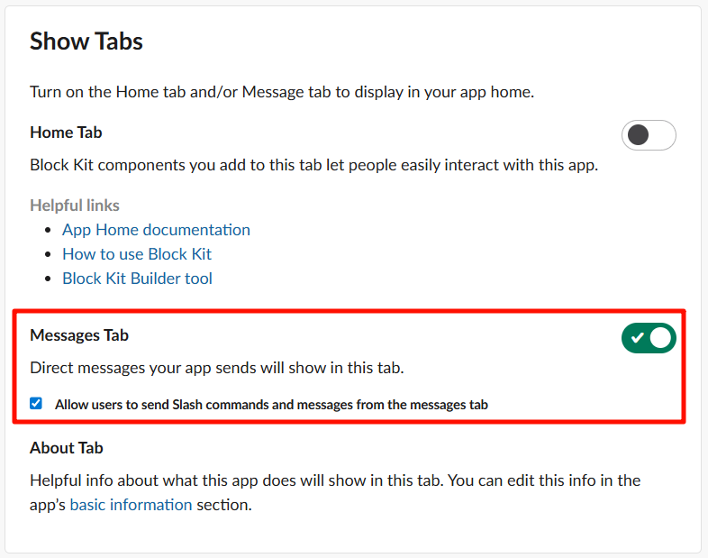

# 快速入门

从零开始，大约 5 分钟内让 Cortex 智能体在聊天工具中回复你，其中大部分时间是在等待 `npm` 安装和填写聊天平台的应用创建页面。

Cortex 通过 Slack 或飞书（Lark）与你对话——任选其一，或同时运行两者。`cortex init` 几乎完成所有工作。你不需要手动编辑任何配置文件。本指南告诉你每个提示的预期内容，并精确指示界面中的操作位置。

## 前置条件

- **Node.js ≥ 20**（Cortex 本身要求 20+；捆绑的编程智能体后端推荐 22）。
- **一个 Slack 工作区或一个飞书（Lark）组织**，你可以在其中创建应用。
- **大约 2 GB 空闲磁盘空间**，用于后端、插件和日志。

你**不需要**预先安装 `claude`（Claude Code）或 `pi`（pi-coding-agent）。不需要预先安装 `git`。不需要预先创建任何目录或 env 文件。`cortex init` 会为你安装所有这些。

### 检查 Node.js 版本

打开终端，运行：

```bash
node --version
```

你应该看到类似 `v22.14.0` 的输出。如果版本低于 20，或看到 `command not found: node`，请使用以下方法安装或升级 Node.js。


### 安装 Node.js

**macOS（Homebrew）：**

```bash
brew install node@22
```

**Linux（nvm，推荐）：**

```bash
curl -o- https://raw.githubusercontent.com/nvm-sh/nvm/v0.40.3/install.sh | bash
# 重启终端，然后：
nvm install 22
nvm use 22
```

**Linux（apt，Ubuntu/Debian 24.04+）：**

```bash
sudo apt update && sudo apt install nodejs npm
```

**Windows：**

从 [nodejs.org](https://nodejs.org/) 下载 LTS 安装包（选择 "LTS" 版本，22.x 或更高）。运行 `.msi` 安装程序并按提示操作。安装完成后重启终端。

验证安装：

```bash
node --version   # 应输出 v22.x.y 或 v20.x.y
npm --version    # 应输出 10.x.y 或更高
```

## 第一步 — 安装 Cortex

```bash
npm install -g @cortex-agent/server
```

这会在你的 PATH 中放置三个命令：`cortex`、`cortex-task`、`cortex-run`。

如果 `npm install -g` 因权限错误而失败（Linux 上常见），请加 `sudo`，或更好的做法是配置 npm 使用用户本地前缀：

```bash
mkdir -p ~/.npm-global
npm config set prefix ~/.npm-global
echo 'export PATH=~/.npm-global/bin:$PATH' >> ~/.bashrc
source ~/.bashrc
npm install -g @cortex-agent/server
```

## 第二步 — 运行设置向导

```bash
cortex init
```

向导会遍历以下提示。默认值都是合理的；按回车接受即可。以下是每个提示的作用及如何回答。

### 2.1 选择语言

```
Select language / 选择语言
❯ English
  中文 (Simplified Chinese)
```

第一个提示选择 Cortex 用于系统生成消息以及本向导其余部分的语言。它默认采用你的系统区域设置，所以中文系统会预选 中文。该选择会保存到 `config/preferences.json`，之后可通过 `!lang` 命令更改。

### 2.2 选择后端

```
? 你想使用哪些编程智能体后端？
❯ ◯ Claude Code（推荐用于 Anthropic 订阅）
  ◯ PI（用于其他订阅）
```

- **Claude Code** — 如果你有 Anthropic 订阅（Claude Pro、Max 或 API），推荐使用。Cortex 会自动安装。
- **PI** — 如果你通过 PI 订阅其他 LLM 提供商，选此项。

你可以两者都选。Cortex 会在下一步对你选择的每个后端运行 `npm install -g`。

### 2.3 选择交互平台

```
? 你想使用哪些交互平台？（空格切换，回车确认，留空跳过）
❯ ◯ Slack（推荐）
  ◯ Feishu (飞书)
```

这是一个多选项。用空格切换，回车确认。可以选 **Slack**、**飞书**，或两者都选——Cortex 会组合你选择的平台并同时连接到所有平台。你选择的每个平台都会触发各自的凭据收集步骤（先 Slack，后飞书）。

留空则跳过平台设置。稍后可通过 `cortex init --force` 或编辑 `$CORTEX_HOME/config/.env` 来配置某个平台。

### 2.4 Slack 应用设置（在浏览器中逐步操作）

如果你没有选择 Slack，跳过本节。

Cortex 首先打印完整的 **Slack 应用清单**，并询问是否要复制到剪贴板。按 **c** 键 — 清单 JSON 现在已复制到剪贴板。


#### a) 打开 Slack API 应用页面

前往 **[https://api.slack.com/apps](https://api.slack.com/apps)**。


#### b) 从清单创建新应用

点击绿色的 **Create New App** 按钮，然后点击 **From a manifest**。如果还没有工作区，需要先创建一个。


#### c) 选择工作区并粘贴清单

1. 从下拉菜单中选择你的 Slack 工作区。
2. 将清单 JSON 粘贴到文本区域（Ctrl+V / Cmd+V）。清单已由 `cortex init` 复制到剪贴板，直接粘贴即可。
3. 点击 **Next**。
4. 查看摘要后点击 **Create**。


#### d) 复制 Signing Secret

创建完成后，Slack 会将你带到应用的 **Basic Information** 页面。在 **App Credentials** 下方，找到 **Signing Secret**。点击 **Show** 并复制。

回到终端，将其粘贴为 `SLACK_SIGNING_SECRET`。



#### e) 生成 App-Level Token（xapp-…）

在同一 **Basic Information** 页面向下滚动到 **App-Level Tokens** 部分。点击 **Generate Token and Scopes**。

- Token Name：`cortex-socket`
- Add Scope：`connections:write`
- 点击 **Generate**

复制出现的令牌（以 `xapp-` 开头）。注意：令牌只显示一次，请立即复制。

回到终端，将其粘贴为 `SLACK_APP_TOKEN`。



#### f) 安装到工作区并复制 Bot Token（xoxb-…）

在左侧边栏中点击 **OAuth & Permissions**。滚动到 **OAuth Tokens** 部分，点击 **Install to Workspace**。在授权页面上点击 **Allow**。

安装完成后，页面顶部会显示 **Bot User OAuth Token**（以 `xoxb-` 开头）。复制它。

回到终端，将其粘贴为 `SLACK_BOT_TOKEN`。




#### g) 启用 Messages Tab

在左侧边栏中点击 **App Home**。向下滚动到 **Show Tabs** 部分：

- 勾选 **Messages Tab**（使其出现在机器人的 App Home 中）。
- 勾选 **Allow users to send Slash commands and messages from the
  messages tab**（以便你可以给机器人发私信）。

如果不勾选此项，你可以在频道中 `@cortex` 机器人，但无法给它发私信。



#### h) 管理频道

Cortex 会把启动通知、审批请求和其他运维消息发送到管理频道。设置过程中无需输入任何内容——Cortex 会在你第一次给机器人发私信时自动检测管理频道并持久化。

如果你想把管理消息发送到指定频道（例如共享的运维频道），从 Slack 获取频道 ID（右键点击频道名称 → View channel details → 在对话框底部复制 Channel ID），然后在 `$CORTEX_HOME/config/.env` 中设置 `CORTEX_ADMIN_CHANNEL`。

### 2.5 飞书应用设置（在浏览器中逐步操作）

如果你没有选择飞书，跳过本节。Cortex 会打印设置指南，然后收集你的应用凭据。

#### a) 创建飞书应用

前往 **[https://open.feishu.cn/app](https://open.feishu.cn/app)**，点击 **创建 agentic 应用**（Create Agentic App）。输入应用名称（例如 `CortexAgent`），选择头像，然后点击 **创建**。

#### b) 复制 App ID 和 App Secret

创建后，应用页面会显示 **App ID** 和 **App Secret**。复制它们。

回到终端，在 `FEISHU_APP_ID` 和 `FEISHU_APP_SECRET` 提示处粘贴。

#### c) 订阅消息事件

在应用的事件配置中，启用机器人事件并订阅 **`im.message.receive_v1`**。如果不订阅，机器人永远收不到你的消息。

#### d) 域名（可选）

```
? FEISHU_DOMAIN（可选，"feishu" 或 "lark"）：
  feishu（留空使用默认值）
```

输入 `feishu` 使用飞书（中国大陆）域名，或输入 `lark` 使用国际 Lark 域名。留空则使用默认值。

#### e) 文档操作的身份

```
? MCP 文档操作的身份：
  bot   —— 文档由应用拥有
❯ user（推荐）—— 文档由你的飞书账号拥有
```

Cortex 的 MCP 工具可以创建和编辑飞书文档（docx、wiki、bitable、sheets、drive）。此提示决定这些文档的归属。选择 **bot** 使应用成为拥有者。选择 **user** 使你自己的飞书账号成为拥有者，文档会保留在你的个人空间中——这是推荐选项。

如果选择 **user**，`cortex init` 会立即运行飞书用户登录（OAuth 设备流程），让你一次性完成授权。它会打印一个 URL——在任意浏览器中打开，批准访问，Cortex 会自动轮询获取令牌，无需重定向 URI。如果你跳过或中止登录，凭据仍会被保存，之后可用 `cortex feishu login` 完成授权。

### 2.6 机器名称

默认为你的主机名。除非你想要自定义标签，否则直接按回车。

### 2.7 GPU 检测

Cortex 运行 `nvidia-smi` 并打印数量。无需输入。如果没有 NVIDIA GPU，它会打印 0 — 对于大多数使用场景完全没问题。

### 2.8 aistatus 令牌使用报告？

可选的，选择是否在 [aistatus.cc](https://aistatus.cc) 的公共排行榜上分享匿名令牌计数。如果选择是，需提供姓名、组织和邮箱（邮箱仅用于身份识别，不会显示）。

### 2.9 注册为系统服务？

- **macOS** — 在 `~/Library/LaunchAgents/com.cortex.daemon.plist` 创建 `launchd` plist。守护进程在登录时自动启动。
- **Linux** — 创建 `systemd --user` 单元（无需 `sudo`）。守护进程在登录时自动启动。
- **Windows** — 不支持。需手动运行 `cortex daemon`。

### 2.10 自动检测后端用于网关/配置？

如果你已在其他终端中运行了 `claude login` 和/或 `pi login`，回答 **Yes**。Cortex 会扫描你的 `~/.claude/.credentials.json` 和 `~/.pi/agent/` 来发现端点，并让你选择哪个发现的（mode, model）对成为 `plan` 配置（由执行智能体使用——planner、doc-writer、coder 等），哪个成为 `execute` 配置（由审查智能体使用）。

你也可以稍后通过 `cortex setup-gateway` 运行此步骤。

---

向导完成后你会看到：

```
Cortex initialized at /home/you/.cortex. Run `cortex daemon` to launch.
```

## `cortex init` 创建了什么

所有内容都位于 `CORTEX_HOME`（默认 `~/.cortex/`）下：

```
~/.cortex/
├── .git/                       # 自动 git 初始化，所有状态均已提交
├── CORTEX.md                   # 根智能体上下文（从默认值初始化）
├── config/
│   ├── .env                    # CORTEX_PLATFORM 列表 + 平台令牌 + CORTEX_MACHINE
│   ├── feishu-user-token.json  # 飞书用户身份令牌（仅当 FEISHU_AUTH_MODE=user 时）
│   ├── preferences.json        # 操作者界面语言
│   ├── budget.json             # 每日/每月预算限制
│   ├── machines.json           # 本机能力（gpuCount、路径）
│   ├── mcp-config.json         # 主 MCP 服务器入口
│   ├── mcp-config-core.json    # 受限上下文的子集
│   ├── mcp-config-tui.json     # TUI 模式的子集
│   ├── profiles.json           # 命名的（后端、模型）配置
│   ├── session-hooks.json      # 会话级钩子管道
│   └── thread-templates.json   # 多智能体线程定义
├── data/
│   ├── mode.json               # 当前模式 + 活跃配置
│   └── schedules.json          # 初始化的周期性任务
├── context/                    # 项目日志存放在这里
│   ├── CORTEX.md、projects/、decisions/、scans/、ideas/、retrospectives/、user/
├── plugins/                    # 8 个角色限定技能插件（默认值的完整副本）
├── prompts/                    # 指令、系统提示、模板
├── rules/                      # 智能体自动加载的规则文件
├── hooks/                      # 钩子脚本（.mjs）
├── .claude/                    # Claude Code 钩子 + 设置
└── logs/                       # 守护进程 + LLM 日志
```

正常使用时你**不应该**手动编辑任何这些文件。`cortex init --force` 会重新生成自动生成的文件（`mcp-config*.json`、`machines.json`、`mode.json`），同时保留你的 `.env`、配置和内容文件。

`~/.aistatus/` 单独存放：

```
~/.aistatus/
├── gateway.yaml                # 网关路由配置（自动生成）
└── config.yaml                 # aistatus 上传器设置（你的姓名/组织/邮箱）
```

## 第三步 — 启动服务器

```bash
cortex daemon         # 受监督运行，崩溃重启 + 热重载
# 或
cortex start          # 前台运行，Ctrl-C 停止
```

如果你在第二步 2.9 中选择了注册系统服务，守护进程已在运行，可以跳过此步骤。通过以下命令检查：

```bash
cortex config         # 打印解析后的路径 + 初始化状态
```

你应该看到确认守护进程正在运行的输出，包括 Slack 连接状态和活跃的配置。


## 第四步 — 发送你的第一条消息

现在进入有趣的部分。打开 Slack 或飞书，找到你刚安装的 Cortex 机器人，发起私信（DM）。

### 4.1 打个招呼

给机器人发私信：

```
hello
```

第一条私信是 Cortex 用来自动检测管理频道的（除非你在 `.env` 中显式设置了 `CORTEX_ADMIN_CHANNEL`）。你应该在几秒钟内收到回复。


### 4.2 创建你的第一个项目

给 Cortex 一个使命。Cortex 会创建项目、设置目录结构并回复确认：

```
创建一个叫"天气看板"的项目，我想做一个显示我所在城市天气的简单网页看板
```

Cortex 会回复它创建的项目结构、分解的初始任务，并询问是否要开始执行。


### 4.3 在已有项目中创建任务

有了项目后，可以直接从 Slack 添加任务：

```
在天气看板项目中添加一个任务：用 Chart.js 做一个5天天气预报的图表
```

Cortex 会将任务添加到项目的 `TASKS.yaml` 中，分配 hex ID、设置优先级和依赖关系，并回复确认。


### 4.4 查看项目状态

```
天气看板项目进展如何
```

Cortex 会读取项目的 `STATUS.md`、`TASKS.yaml` 和最近的实验记录，然后给你一个当前状况的摘要。

一旦项目任务队列中有任务，Cortex 会自动挑选并派发优先级最高且就绪的任务——你不需要告诉它"开始执行"。只需持续添加任务，Cortex 会自主推进。

## 接下来读什么

- 创建 Slack 应用时出了问题，或想在运行 `cortex init` 之前先完成设置 — 阅读 [slack-setup.md](./slack-setup.md)。
- 想了解 Cortex 识别的每个配置文件和环境变量，或覆盖某个自动生成的路径 — 阅读 [configuration.md](./configuration.md)。
- 想了解每个 CLI 子命令和标志 — 阅读 [cli-reference.md](./cli-reference.md)。
- 想切换后端或添加其他提供商 — 阅读 [backends.md](./backends.md)。
- 想了解多智能体线程管道的工作原理 — 阅读 [threads.md](./threads.md)。
- 想将远程机器连接到 Cortex — 阅读 [cross-machine.md](./cross-machine.md)。
- 想了解项目日志结构（实验、知识、模式）— 阅读 [memory.md](./memory.md)。
